# 基于springboot+vue的安康旅游网站

---
### 👉作者QQ ：1556708905 微信：zheng0123Long (支持定制修改、部署调试、定制毕设)

### 👉接网站建设、小程序、H5、APP、各种系统等

---

#### 介绍

我开发了一个基于SpringBoot和Vue的安康旅游网站，旨在为游客提供便捷的旅游信息查询和预订服务，同时为管理员提供高效的管理工具。该系统分为管理员角色和游客角色，管理员负责管理景点信息、旅游线路、酒店信息、特产等内容，游客则可以浏览和预订旅游资源，并进行反馈和收藏。该系统集成了景点、酒店、特产等多个模块，为用户提供一站式的旅游服务体验，提升了旅游管理的效率和用户的满意度。

#### 技术栈

后端技术栈：Springboot+Mysql+Maven

前端技术栈：Vue+Html+Css+Javascript+ElementUI

开发工具：Idea+Vscode+Navicate

#### 系统功能介绍

管理员角色功能模块

个人中心：管理员可以在个人中心管理自己的个人信息，包括修改密码、更新联系方式等。这一模块保障了管理员账户的安全性和信息的时效性。

游客管理：管理员可以管理注册游客的信息，包括添加、修改和删除游客信息，确保用户信息的准确和完整。

景点信息管理：管理员负责录入和管理景点的基本信息，包括景点的名称、位置、介绍、开放时间、票价等，确保游客可以获取到最新、最准确的景点信息。

市区管理：管理员可以管理旅游城市的各个市区信息，详细记录每个市区的旅游资源和特色，方便游客根据地区选择旅游目的地。

地区管理：管理员可以管理各个地区的旅游资源信息，帮助游客了解各地区的旅游特色和资源分布。

旅游线路管理：管理员可以设计和管理旅游线路，包括线路的起点、终点、途经景点、行程安排等，帮助游客规划出行路线。

酒店信息管理：管理员可以管理各个酒店的基本信息，包括酒店的名称、位置、房型、价格、设施等，为游客提供全面的住宿选择。

特产管理：管理员可以管理地方特产的基本信息，包括特产名称、产地、价格、介绍等，帮助游客了解和购买当地特产。

景点购票订单管理：管理员负责管理景点门票的订单，包括订单的生成、查询、修改和删除，确保订单信息的准确和及时。

购票取消订单管理：管理员处理游客取消的景点门票订单，包括取消原因的记录和退款处理，提升用户体验。

酒店订单管理：管理员负责管理游客预订的酒店订单，包括订单的生成、查询、修改和删除，确保预订信息的准确和及时。

酒店取消订单管理：管理员处理游客取消的酒店订单，包括取消原因的记录和退款处理，提升用户体验。

特产订单管理：管理员负责管理游客购买的特产订单，包括订单的生成、查询、修改和删除，确保订单信息的准确和及时。

特产取消订单管理：管理员处理游客取消的特产订单，包括取消原因的记录和退款处理，提升用户体验。

留言板管理：管理员管理游客的留言和反馈，包括留言的审核、回复和删除，确保平台的互动性和用户满意度。

我的收藏管理：管理员管理自己收藏的内容，包括景点、线路、酒店等，方便快速访问常用资源。

系统管理：管理员负责系统的整体管理与维护，包括用户权限管理、系统日志查看、数据备份与恢复等，确保系统的安全稳定运行。

游客角色功能模块

景点信息：游客可以浏览景点的详细信息，包括景点的名称、位置、介绍、开放时间、票价等，方便游客了解和选择旅游景点。

旅游线路：游客可以查看和选择合适的旅游线路，包括线路的起点、终点、途经景点、行程安排等，帮助游客规划出行路线。

酒店信息：游客可以查询和预订酒店，包括酒店的名称、位置、房型、价格、设施等，为游客提供全面的住宿选择。

特产：游客可以浏览和购买地方特产，包括特产的名称、产地、价格、介绍等，帮助游客了解和购买当地特产。

旅游新闻公告：游客可以查看最新的旅游新闻和公告，包括景点活动、旅游政策、天气预报等，获取及时的旅游信息。

留言反馈：游客可以在留言板上留言反馈意见和建议，包括对景点、线路、酒店的评价和建议，提升平台的互动性和用户满意度。

个人中心：游客可以在个人中心管理自己的个人信息，包括修改密码、更新联系方式等，保障账户的安全性和信息的时效性。

后台管理：

旅游线路管理：游客可以管理自己选择的旅游线路，包括查看已选择的线路、修改线路安排等，提升出行的灵活性和便利性。  
景点购票订单管理：游客可以查看和管理景点门票订单，包括订单的生成、查询、修改和删除，确保订单信息的准确和及时。  
购票取消订单管理：游客可以管理已取消的景点门票订单，包括取消原因的记录和退款处理，提升用户体验。  
酒店订单管理：游客可以查看和管理酒店预订订单，包括订单的生成、查询、修改和删除，确保预订信息的准确和及时。  
酒店取消订单管理：游客可以管理已取消的酒店订单，包括取消原因的记录和退款处理，提升用户体验。  
特产订单管理：游客可以查看和管理特产购买订单，包括订单的生成、查询、修改和删除，确保订单信息的准确和及时。  
特产取消订单管理：游客可以管理已取消的特产订单，包括取消原因的记录和退款处理，提升用户体验。  
我的收藏管理：游客可以管理个人收藏的景点、线路、酒店等，方便快速访问常用资源。  

#### 系统作用

管理员角色：通过全面的管理功能模块，管理员可以高效地管理景点信息、旅游线路、酒店信息、特产等内容，确保信息的准确性和及时更新。同时，通过订单管理、留言板管理等模块，管理员可以及时处理游客的订单和反馈，提升服务质量和用户满意度。  

游客角色：游客可以通过系统方便地浏览和预订旅游资源，包括景点、旅游线路、酒店和特产等。通过个人中心和后台管理，游客可以管理自己的订单和收藏，提升出行的灵活性和便利性。留言反馈功能使游客能够与平台互动，提供意见和建议，提升整体用户体验。  

#### 系统功能截图

代码结构

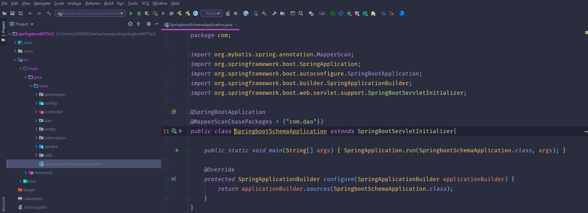

数据库表

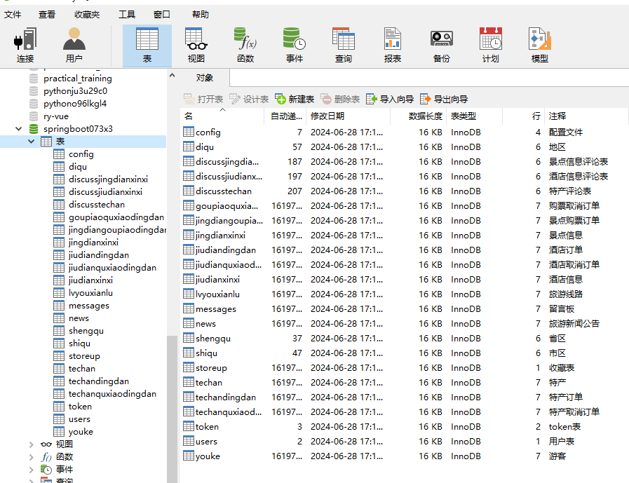

登录

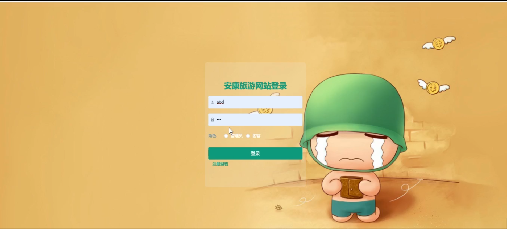

游客管理

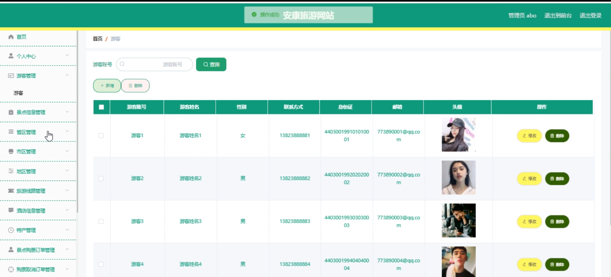

景点信息管理

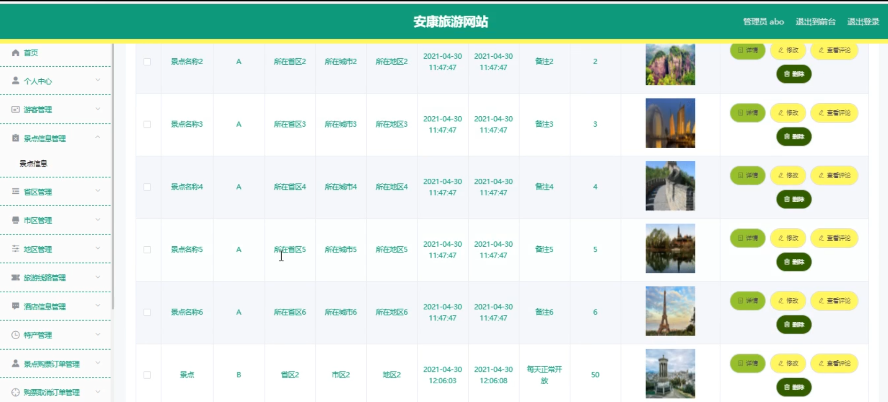

酒店信息管理

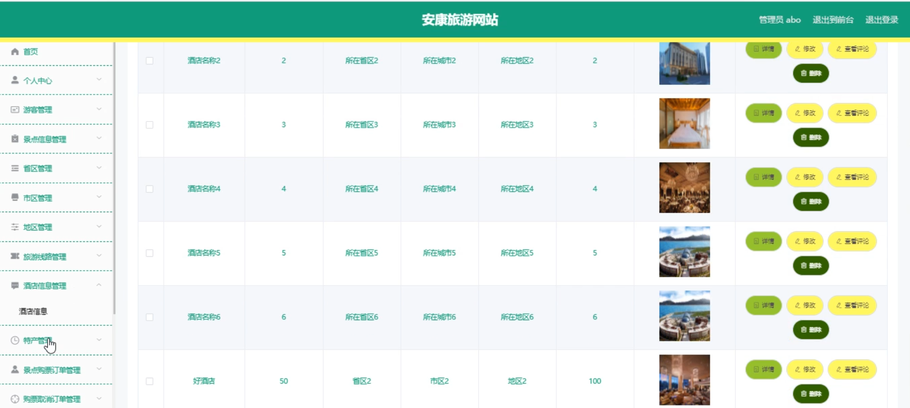

特产管理

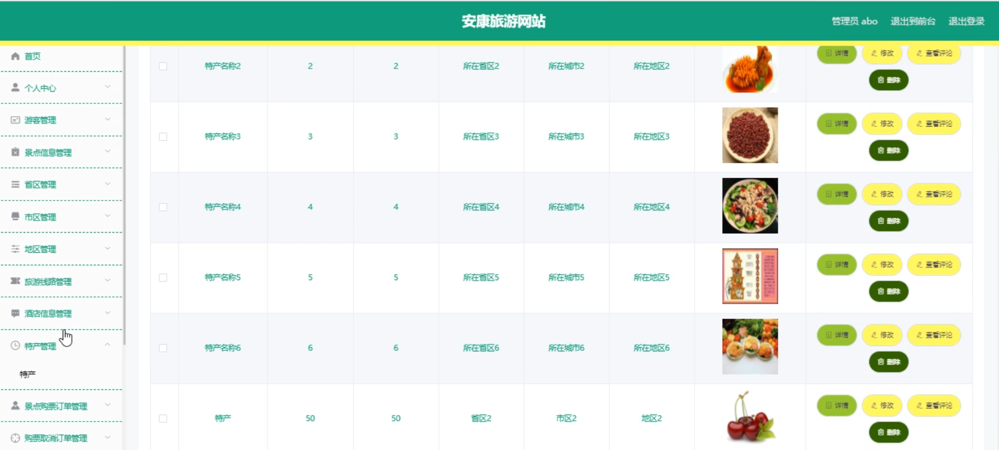

景点购票订票管理

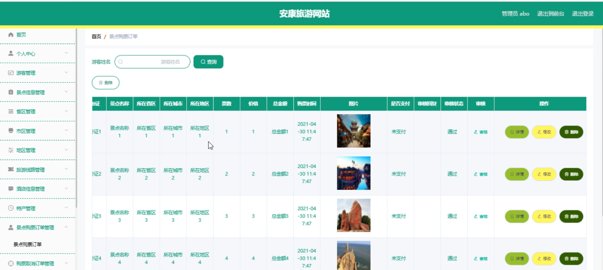

系统管理

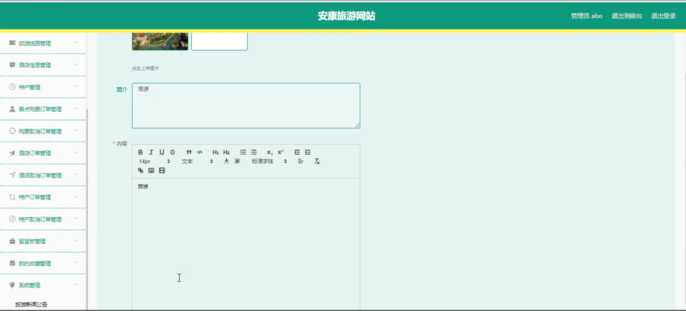

前台页面首页

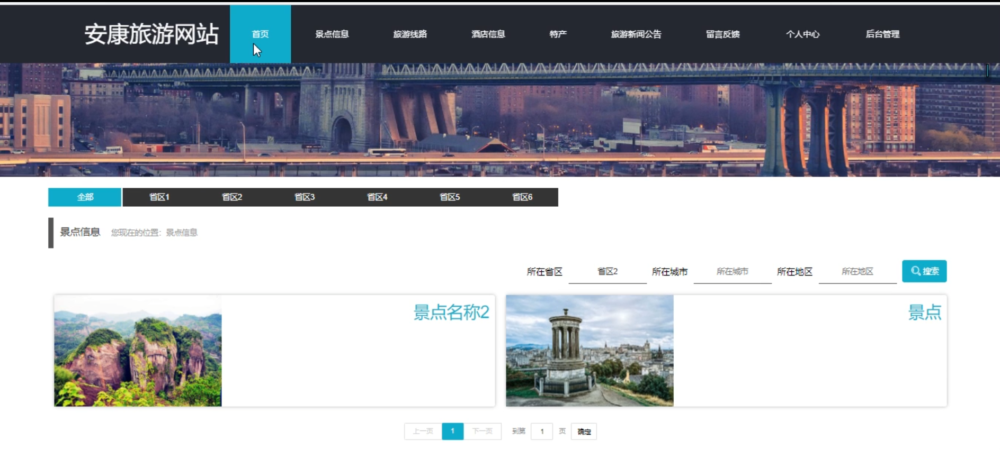

个人中心

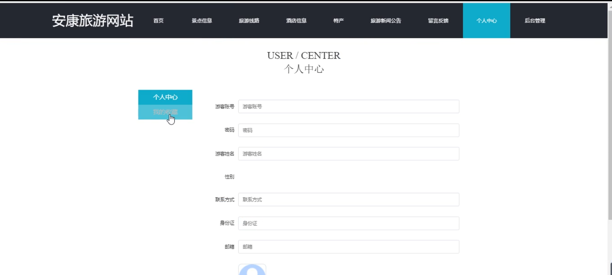

留言反馈

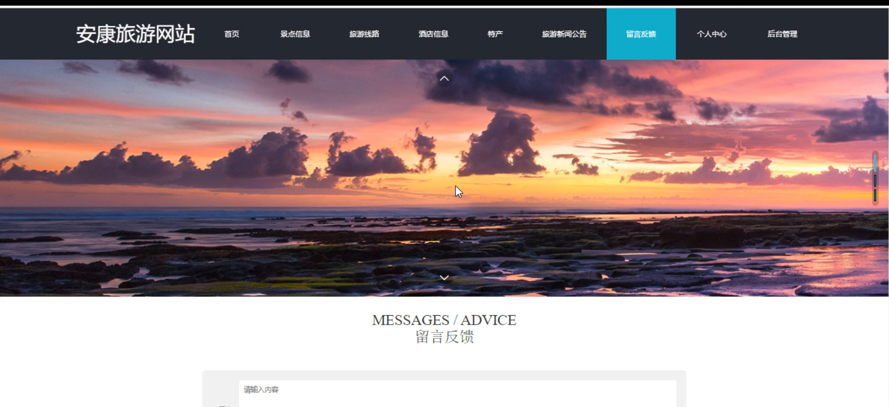

游客端后台管理

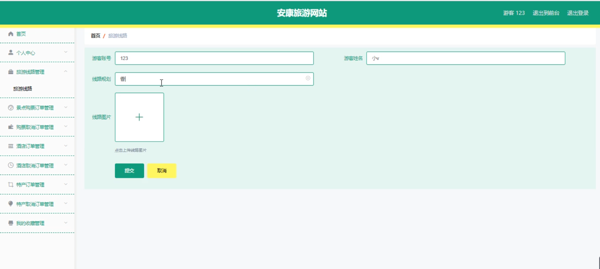

特产取消订单管理

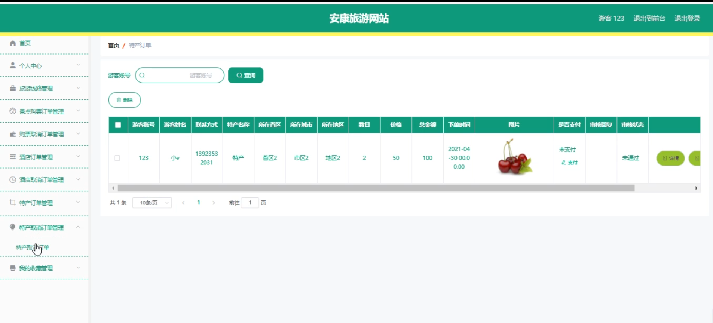

酒店订单管理

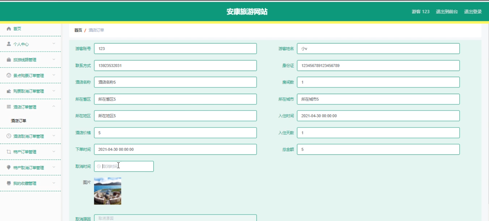

#### 总结

基于SpringBoot和Vue的安康旅游网站通过集成多个功能模块，实现了旅游资源的高效管理和便捷查询预订。管理员和游客通过各自的角色和功能模块，提升了管理效率和用户体验。系统的全面性和互动性使其能够满足不同用户的需求，提升了旅游服务的整体水平。未来可以根据用户反馈和需求，继续优化和扩展系统功能，提供更完善的服务。

#### 使用说明

创建数据库，执行数据库脚本 修改jdbc数据库连接参数 下载安装maven依赖jar 启动idea中的springboot项目

后台地址：http://localhost:8080/springboot073x3/admin/dist/index.html

管理员  abo 密码 abo

前台地址：http://localhost:8080/springboot073x3/front/index.html

